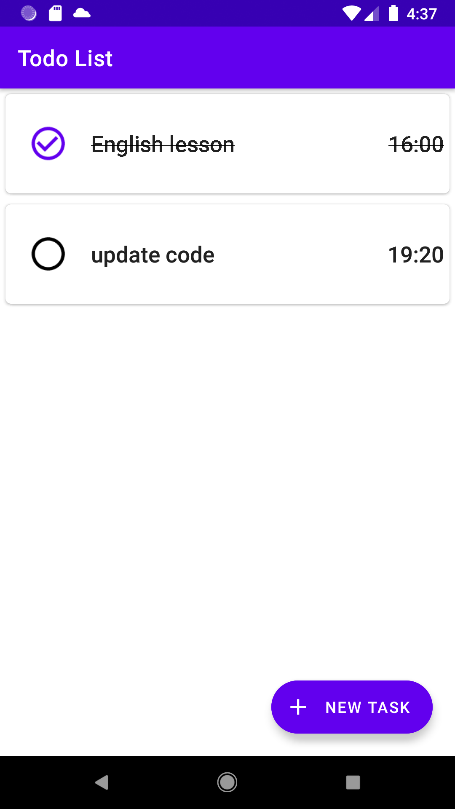
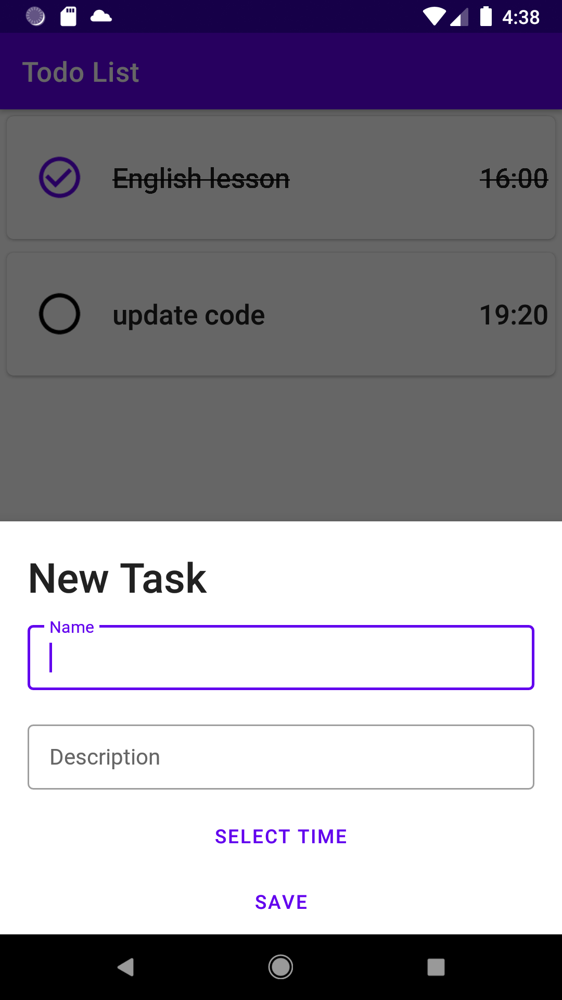
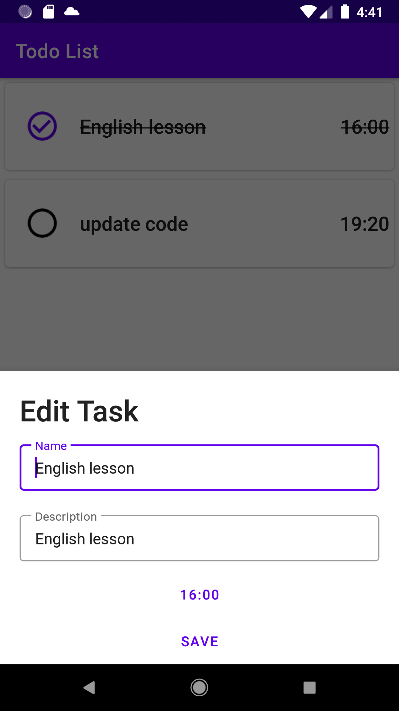
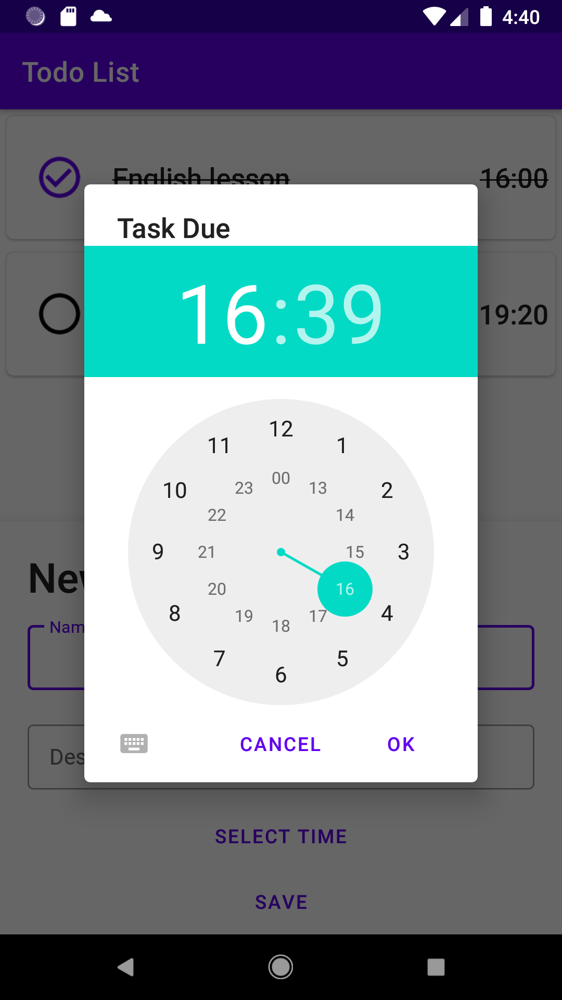

# TodoList
This is a simple Todo application that uses a RecyclerView with a CardView in each cell, utilizing Material Design components. It allows users to mark each item as completed, as well as reuse the edit modal for new and existing task items.

## Features

* RecyclerView
* Material Design Components
* Bottom Sheet
* MVVM (Model-View-ViewModel) Architecture
* ViewModel
* View Holder
* View Binding
* Room Database
* Adapter
* Fragment

## Screenshots
  

 

## Documentation
- [Documentation Android]([https://pub.dev/packages/jitsi_meet_flutter_sdk](https://developer.android.com/develop))

## Tech Stack

* **Client:** Kotlin
* **Database:** SqlLite with Room

